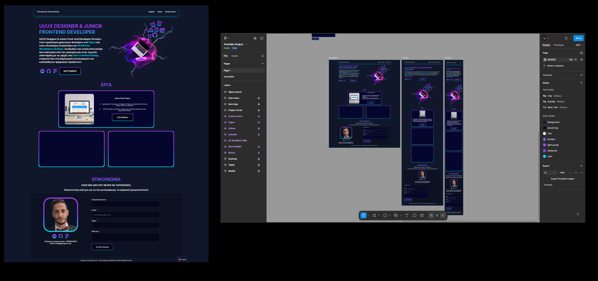
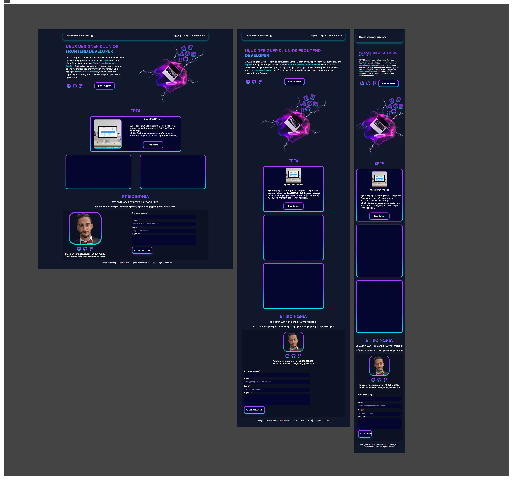

## Apospan Portfolio Project

A modern, bilingual Personal Portfolio designed with a focus on **UI/UX Excellence.** The project was developed starting from a blank canvas in Figma and evolved into a fully functional, dynamic website.

---

## Design System & UI/UX

🔹 **Theme:** Dark Mode aesthetic with a "Modern Tech" look. 
🔹 **Color Palette:** Deep Navy background (`#050719`) with neon gradients (`#AF40FF` to `#00DDEB`) for interactive elements. 
🔹 **Typography:** Clean, sans-serif fonts for maximum readability in digital environments.

---

## Project Workflow

### 1. Design Phase (UI/UX)

🔹**Figma Design:** Visual design and design system (layout, colors, typography) created for full UI control. 
🔹 **Prototyping:** Flow creation to ensure seamless User Experience (UX) across desktop and mobile.

### 2. Development & Implementation

🔹 **Local-to-Staging Workflow:** Developed in Local WP and tested in a Staging environment (Hostinger) for secure deployment. 
🔹 **Dynamic CMS Engine:** Custom PHP implementation (WP_Query) and Advanced Custom Fields (ACF) to replace static widgets with dynamic content loops. 
🔹 **Native Modal System:** Custom-coded PHP/JS popup system to ensure unique project IDs and superior performance. 
🔹 **Breakdance Builder:** Used as the base for performance-oriented HTML markup. 
🔹 **Advanced Localization:** **TranslatePress** integration with Gettext (\_e) support for GR/EN content and dynamic PDF links. 
🔹 **Custom Styling:** **Custom CSS** for Fluent Forms and buttons styling, achieving 100% fidelity to the Figma design.

### 3. Technical Infrastructure (Backend UX)

🔹 **Email System:** Professional email configuration via **FluentSMTP**. 
🔹 **Domain & DNS Security:** osted on **Hostinger** using default DNS for stability and LiteSpeed for optimization.

---

## 🇬🇷 Ελληνική Έκδοση

  
<b>Κάντε κλικ για να δείτε την περιγραφή στα Ελληνικά</b>

## Apospan Portfolio Project

Ένα σύγχρονο, δίγλωσσο Personal Portfolio σχεδιασμένο με γνώμονα το **UI/UX Excellence** Το project αναπτύχθηκε ξεκινώντας από λευκό καμβά στο Figma και κατέληξε σε ένα πλήρως website.

---

## Design System & UI/UX

🔹 **Theme:** Dark Mode αισθητική με έμφαση στο "Modern Tech" look. 
🔹 **Color Palette:** Deep Navy background (`#050719`) με neon gradients (`#AF40FF` έως `#00DDEB`) για τα διαδραστικά στοιχεία. 
🔹 **Typography:** Καθαρή, sans-serif γραμματοσειρά για μέγιστη αναγνωσιμότητα σε digital περιβάλλον. 

---

## Project Workflow

### 1. Design Phase (UI/UX)

🔹 **Figma Design:** Σχεδιασμός ολόκληρου του οπτικού μέρους και του design system (layout, χρώματα, τυπογραφία) για πλήρη έλεγχο του UI. 
🔹 **Prototyping:** Δημιουργία flows για τη διασφάλιση άψογης εμπειρίας χρήστη (UX) σε desktop και mobile. 

### 2. Development & Implementation

🔹 **Local-to-Staging Workflow:** Ανάπτυξη σε τοπικό περιβάλλον με το Local WP και δοκιμές σε Staging environment (Hostinger) για ασφαλές deployment. 
🔹 **Dynamic CMS Engine:** Custom PHP υλοποίηση (WP_Query) και χρήση του Advanced Custom Fields (ACF) για την αντικατάσταση των στατικών στοιχείων με δυναμικά loops περιεχομένου. 
🔹 **Native Modal System:** Custom-coded σύστημα popups με PHP/JS για τη διασφάλιση μοναδικών IDs ανά project και κορυφαία απόδοση. 
🔹 **Breakdance Builder:** Χρησιμοποιήθηκε ως βάση για τη δημιουργία καθαρού HTML markup με έμφαση στο performance. 
🔹 **Advanced Localization:** Ενσωμάτωση του TranslatePress με υποστήριξη Gettext (\_e) για πλήρη δίγλωσση λειτουργία (GR/EN) και δυναμική εναλλαγή αρχείων PDF. 
🔹 **Custom Styling:** **Custom CSS** για το styling των Fluent Forms και των buttons, πετυχαίνοντας 100% ταύτιση με το Figma design.

### 3. Technical Infrastructure (Backend UX)

🔹 **Email System:** Επαγγελματική παραμετροποίηση αλληλογραφίας μέσω **FluentSMTP** με ρυθμίσεις SPF, DKIM και DMARC.. 
🔹 **Hosting & Security:** Φιλοξενία στη Hostinger με χρήση των default DNS για μέγιστη σταθερότητα και LiteSpeed για βελτιστοποίηση ταχύτητας.

## Project Preview

**More Screenshots**

  
<b>Click to view the full gallery / Κάντε κλικ για την πλήρη συλλογή </b>

  
  

     
     
     
     
     
     
     
     
     

  

## Tech Stack

🔹 **Design:** Figma  
🔹 **Development:** WordPress, PHP, Advanced Custom Fields (ACF). 
🔹 **Frontend:** CSS3 (Custom Gradients), JavaScript (Modals), Breakdance Builder. 
🔹 **Tools** Local WP, VS Code, GitHub Desktop. 
🔹 **Plugins:** TranslatePress, FluentSMTP, Fluent Forms, Breakdance, LiteSpeed ​​Cache , WPvivid Backup,ΑCF(Advanced Custom Fields),Code Snippets

## Links

🔹 **Live Website::** [\[apospan.com\]](https://apospan.com/)

🔹 **LinkedIn:** [\[Panagiotis Apostolelis\]](https://www.linkedin.com/in/panagiotis-apostolelis/)

🔹 **Figma:** [\[Παναγιώτης Αποστολέλης\]](https://www.figma.com/@PanApos)
